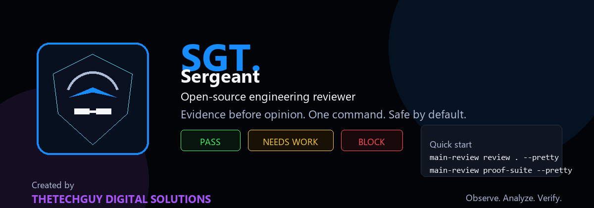

<p align="center">
  
</p>

# Sergeant

**Sergeant (SRG)** is a model-free engineering reviewer created by **THETECHGUY DIGITAL SOLUTIONS**.

It reviews repositories and changed files, checks engineering evidence, and returns one clear verdict:

```text
PASS
NEEDS WORK
BLOCK
```

Sergeant does **not** require an AI-provider login, hosted model, API key, or large GPU for normal review. Cpl, permanent officers, privates, deterministic detectors, verified lessons, scanners, and proof gates form the standard review path.

One model or a bounded multi-model council can be enabled later as **optional extra reasoning**. Models never become Sergeant's identity, dependency, vote, or final authority.

## What Sergeant does

- Reviews a repository, current file, or changed files.
- Checks correctness, security, architecture, tests, documentation, and release proof.
- Separates proven findings from advisories and unsupported claims.
- Produces evidence-based reports that can be opened, copied, or exported.
- Keeps patch writing and merging outside the default reviewer authority.

## IDE extensions

The VS Code and JetBrains extensions provide a focused front end for the same Sergeant CLI.

### Main actions

- **Review Workspace**
- **Review Current File**
- **Review Changed Files**
- **Run Final Proof**
- **Open Last Report**

Advanced proof, battle, App Bridge, and optional model settings remain available without crowding the normal review flow.

## Install

### Python / CLI

```bash
python -m pip install -U sergeant-reviewer
```

Review the current repository:

```bash
sergeant pr-review . --pretty
```

Run the final proof gate:

```bash
sergeant final-proof . --pretty
```

### VS Code / Open VSX

Install **Sergeant** from the extension marketplace and open it from the activity bar.

For a local package:

```bash
npx @vscode/vsce package --no-dependencies
code --install-extension sergeant-reviewer-*.vsix --force
```

### JetBrains

Install the Sergeant plugin, ensure the `sergeant` CLI is available, and open **Sergeant** from the tool-window bar.

Set `SERGEANT_CLI` only when the executable is not available on the IDE process path.

## Standard review architecture

```text
Repository / changed files
        ↓
Model-free Cpl coordination
        ↓
Permanent officers and privates
        ↓
Deterministic evidence and verified lessons
        ↓
Analyst reconciliation, Challenger, and Judge ledger
        ↓
Sergeant verdict
```

## Optional extra reasoning

Optional model support is disabled by default. Users may explicitly enable a local gateway, Ollama, LM Studio, or another approved OpenAI-compatible endpoint.

```text
Disabled  → standard model-free Sergeant
Preferred → optional reasoning with model-free fallback
Required  → explicit user-selected model-assisted gate
```

Detailed provider and council configuration belongs in the advanced documentation, not the normal marketplace overview:

- [`docs/54-model-free-core-and-optional-reasoning.md`](docs/54-model-free-core-and-optional-reasoning.md)
- [`docs/22-semantic-open-model-review.md`](docs/22-semantic-open-model-review.md)
- [`docs/CLOUDFLARE_COUNCIL.md`](docs/CLOUDFLARE_COUNCIL.md)

## Safety boundary

Sergeant does not:

- execute pull-request-controlled commands;
- automatically modify project source;
- automatically promote learning signals;
- automatically merge patches;
- treat a model or external reviewer as final authority;
- expose configured credentials in reports.

## Engineering standard

```text
Understand
→ Build
→ Review
→ Freeze
→ Prove
→ Submit / Ship
```

Evidence comes before confidence. Tests prove engineering; they do not replace engineering judgment.

## Documentation

- [Product boundary](docs/54-model-free-core-and-optional-reasoning.md)
- [Cross-repository learning intake](docs/51-cross-repository-learning-intake.md)
- [Release notes](docs/releases/)
- [Agent working memory](AGENTS.md)
- [Submission readiness](SUBMISSION_READY.md)

## Identity

**Sergeant / SRG** is created by **THETECHGUY DIGITAL SOLUTIONS**.

> Observe. Analyze. Verify.
